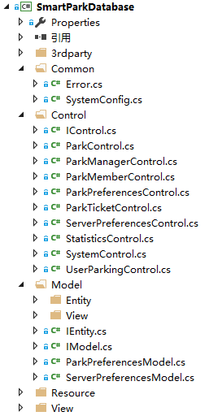

# SmartParkDatabase是智能停车管理系统的底层封装类

 

## 1. 程序目录结构

> * Common：公共程序
> 1. Error.cs：系统的错误信息
> 2. [SystemConfig.cs：](Documents/Common/SystemConfig.md)系统的配置信息，包括数据库默认信息和各类型的默认值
> * Control：停车场控制器
> 1. IControl.cs：停车场控制器接口类
> 2. [ParkControl.cs：](Documents/Control/ParkControl.md)停车场基本信息控制器类
> 3. [ParkManagerControl.cs：](Documents/Control/ParkManagerControl.md)停车场管理员控制器类
> 4. [ParkMemberControl.cs：](Documents/Control/ParkMemberControl.md)停车场会员控制器类
> 5. [ParkPreferencesControl.cs：](Documents/Control/ParkPreferencesControl.md)停车场信息持久化控制器类
> 6. [ParkTicketControl.cs：](Documents/Control/ParkTicketControl.md)停车场优惠券控制器类
> 7. [ServerPreferencesControl.cs：](Documents/Control/ServerPreferencesControl.md)停车场服务器控制器类
> 8. StatisticsControl.cs：停车场统计控制器类
> 9. [SystemControl.cs：](Documents/Control/SystemControl.md)停车场系统控制器类
> 10. [UserParkingControl.cs：](Documents/Control/UserParkingControl.md)用户停车控制器类
> * Model：停车场模型
> 1. Entity：停车场实体模型
> 2. View：停车场视图实体模型
> 3. [IEntity.cs：](Documents/Model/IEntity.md)停车场实体接口类
> 4. IModel.cs：停车场模型接口类
> 5. [ParkPreferencesModel.cs：](Documents/Model/ParkPreferencesModel.md)停车场信息持久化模型类
> 6. [ServerPreferencesModel.cs：](Documents/Model/ServerPreferencesModel.md)停车场系统持久化模型类
> * Resource：系统资源
> * View：停车场视图

## 2. 引入的第三方库

| 库名称 | 库版本 | .Net版本 |
| :----: | :----: | :----: |
| CDatabase | 0.8 | 2.0-4.5 |
| CSharedPreferences | 0.1 | 2.0-4.5 |
| MySql.Data | 6.9 | 2.0-4.5 |
| Newtonsoft.Json | 9.0.1 | 2.0-4.5 |

## 3. 引入的第三方库

### 方法一：通过Vistual Studio自带的NuGet包管理工具引用第三方库

### 方法二：通过项目引用第三方DLL库

> 右键项目->添加->引用->浏览(B)...->选择需要的DLL->确定